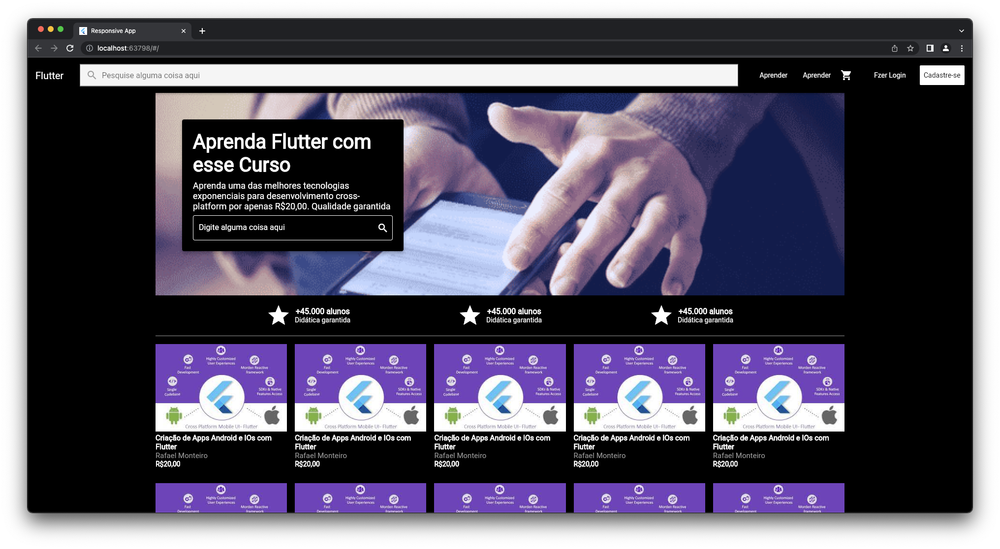
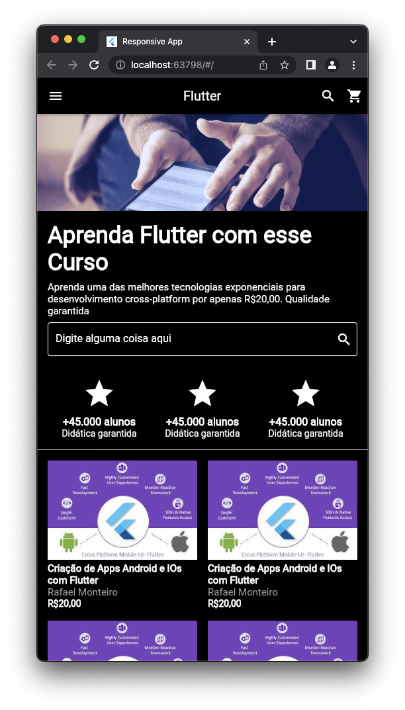

<!-- description section-->

# Udemy UI Clone

 A clone of Udemy home page. This project's goal is to test Flutter WEB features. Here the udemy home UI is a bit outdated. The current interface is quite different.

    
    

https://rsoares10-flutter.github.io/udemy-ui-clone/

<!--Page gh-pages deploy link section-->

# Interactive test

 You can check the resulting clone interactively <a href="https://rsoares10-flutter.github.io/udemy-ui-clone/">here</a>

